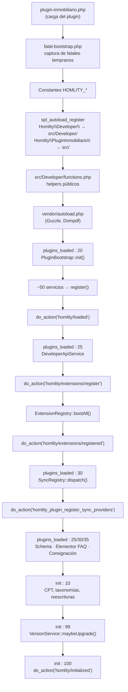
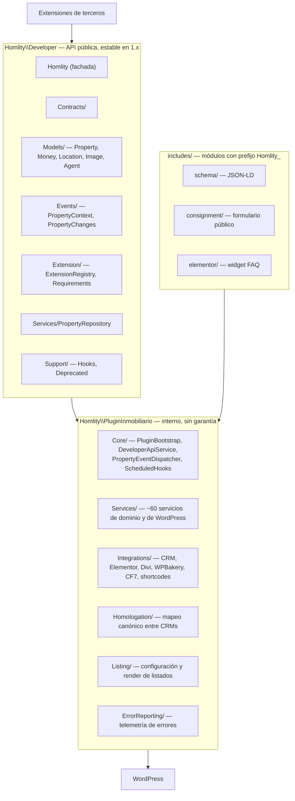
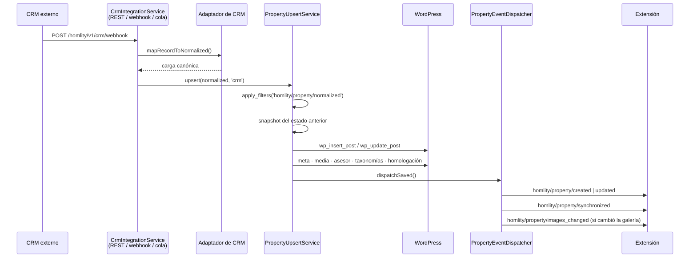

# Arquitectura actual de Homlity Real Estate

Estado del plugin en la versión **2.8.0**. Este documento describe cómo
funciona el núcleo por dentro. No es documentación para desarrolladores de
extensiones — para eso está [`docs/developers/`](../developers/README.md) —
sino el mapa que necesita quien vaya a tocar el propio plugin.

---

## 1. Identidad

| | |
| --- | --- |
| Nombre | Homlity Real Estate |
| Slug | `homlity-real-estate` |
| Archivo principal | `plugin-inmobiliario.php` |
| Namespace interno | `Homlity\PluginInmobiliario\` → `src/` |
| Namespace público | `Homlity\Developer\` → `src/Developer/` |
| Licencia | GPLv2 o posterior |
| PHP mínimo | 8.0 |
| WordPress mínimo | 5.8 |

---

## 2. Arranque

El arranque es explícito y está todo en `plugin-inmobiliario.php`. No hay
contenedor de servicios ni descubrimiento automático: la lista de servicios se
declara a mano en `Core\PluginBootstrap::init()`.

Los módulos de `includes/` (schema, Elementor FAQ, consignación) usan clases
con prefijo `Homlity_` y `require_once` explícito, no PSR-4. Son anteriores a
la reorganización en `src/` y siguen la convención antigua de WordPress.

---

## 3. Capas

La regla es de una sola dirección: las extensiones dependen de
`Homlity\Developer\`, y `Homlity\Developer\` es lo único que el núcleo se
compromete a no romper.

---

## 4. Modelo de datos

### Custom post types

| Post type | Clase | Para qué |
| --- | --- | --- |
| `property` | `Services\PropertyPostType` | El inmueble |
| `homlity_locality` | `Services\LocalityPostType` | Localidades y sus barrios |

### Taxonomías del inmueble

Todas en `Services\PropertyTaxonomies`:

`property_type`, `property_operation`, `property_location`,
`property_category`, `property_tag`, `property_feature`, `property_country`,
`property_state`, `property_city`, `property_neighborhood`, `property_nearby`,
`property_condition`.

`property_location` es una taxonomía plana que recoge todos los términos
geográficos del inmueble a la vez, para poder consultar por cualquier nivel sin
saber cuál es.

### Post meta

Alrededor de 55 claves, todas con prefijo `_property_` o `_consignment_`. La
lista completa vive en `PropertyPostType::$metaKeys` y su correspondencia con
el esquema canónico en `Integrations\CRM\FieldMap\PropertyFieldSchema::metaMap()`.

### Tablas propias

| Tabla | Repositorio | Contenido |
| --- | --- | --- |
| `{prefix}homlity_homologation` | `Homologation\HomologationRepository` | Mapeo CRM → término canónico |
| `{prefix}homlity_sync_index` | `Integrations\CRM\Repository\SyncIndexRepository` | `(source, external_id) → post_id` |
| `{prefix}homlity_sync_jobs` | `PullSyncJobRepository` | Estado de los trabajos de descarga |
| `{prefix}homlity_webhook_events` | `WebhookEventRepository` | Eventos recibidos por webhook |
| `{prefix}homlity_property_visits` | `Services\PropertyVisitTrackingService` | Analítica de visitas |
| `{prefix}homlity_property_contact_clicks` | `PropertyContactClickTrackingService` | Clics de contacto |
| `{prefix}homlity_property_sheet_downloads` | `PropertyTechnicalSheetDownloadTrackingService` | Descargas de ficha |

### Opciones

Prefijo `homlity_` (o `homlity_plugin_`). Las principales:
`homlity_plugin_settings`, `homlity_plugin_version`,
`homlity_plugin_crm_integrations`, `homlity_plugin_crm_sync_queue`,
`homlity_plugin_crm_sync_logs`, `homlity_seo_settings`,
`homlity_schema_settings`, `homlity_llms_full`,
`homlity_error_reporter_queue`.

---

## 5. Ciclo de vida de un inmueble

Hay exactamente dos caminos por los que un inmueble se escribe entero, y ambos
terminan disparando las acciones públicas.

El camino de wp-admin es análogo: `save_post_property` →
`PropertyPostType::saveMeta()`, que valida el nonce, escribe todo y llama al
mismo despachador con origen `admin`. `saveMeta()` sale temprano cuando no hay
nonce de formulario, y por eso una escritura de CRM no dispara los hooks dos
veces.

Borrado y cambio de estado no pasan por ninguno de los dos: se enganchan a
`before_delete_post` y `transition_post_status` desde `DeveloperApiService`, de
modo que se detectan escriba quien escriba.

---

## 6. Integraciones

### CRM

`Integrations/CRM/` es el subsistema más grande.

- `CrmIntegrationManager` — registro de adaptadores. Dispara
  `homlity_crm_register_adapters` y filtra por `homlity_crm_adapters`.
- `CrmAdapterInterface` — un adaptador sólo traduce; no escribe.
- `PropertyUpsertService` — la única escritura de inmuebles del subsistema.
- `CrmSyncQueueService` — cola en una opción, procesada por WP-Cron
  (`homlity_plugin_crm_process_queue`).
- `Services/WebhookAuthenticator` — verificación de firma de los webhooks.
- `Services/VersionedPropertySchemaValidator` — validación de la carga canónica.
- `Services/MediaSyncService` — descarga de imágenes.
- `Services/AdvisorSyncService` — resuelve o crea el usuario asesor.

### Sincronización bajo demanda

`Services\SyncRegistry` + `Contracts\SyncProviderInterface`. Cuando alguien
abre `/inmueble/{CODIGO}` y el inmueble no existe en local,
`PropertyCodeRoutingService` recorre los proveedores registrados por orden de
prioridad hasta que uno lo crea, y redirige 301 a la URL canónica.

### Constructores de página

Elementor, Divi y WPBakery tienen cada uno ~25 widgets que comparten
maquetación a través de `templates/parts/`. Cada `*IntegrationService` es un
no-op cuando su constructor no está instalado.

### Otras

Contact Form 7, Elementor Pro Forms, Ninja Forms (override de WhatsApp),
Polylang y WPML (registro del post type), y once shortcodes.

---

## 7. Superficie HTTP

### REST

| Namespace | Alcance |
| --- | --- |
| `homlity/v1` | CRM: webhooks, sincronización, cola, esquema, logs |
| `homlity-real-estate/v1` | Editor de inmuebles, ajustes, analítica, versiones, diagnóstico |
| Homologación | `homologation/*` — mapeos, fuentes, estadísticas |
| Consignación | `free/v1/*` y `v1/*` — formulario público y datos geográficos |

### AJAX

`homlity_listing` (con y sin sesión) y `homlity_track_contact_click`.

### WP-Cron

`homlity_plugin_crm_process_queue`, `homlity_error_reporter_deliver`,
`homlity_purge_orphan_analytics`. Todos declarados en `Core\ScheduledHooks`,
que los desprograma al desactivar el plugin.

### WP-CLI

No hay comandos propios. `ErrorEventFactory` sólo detecta si la petición viene
de WP-CLI para etiquetar el contexto del error.

---

## 8. Seguridad

- Todos los archivos empiezan con la guarda `if (!defined('ABSPATH')) exit;`.
- Las escrituras de wp-admin verifican nonce y `current_user_can('edit_post')`.
- Los webhooks de CRM se autentican con firma (`WebhookAuthenticator`).
- Las rutas REST administrativas exigen capacidad; las públicas están acotadas
  al formulario de consignación y llevan límite de tasa
  (`homlity_consignment_rate_limit_allowed`).
- Las capacidades propias las gestiona `Services\CapabilityService`, con el rol
  de asesor y su equivalente heredado.
- El reporter de errores sanea el contexto antes de enviarlo
  (`ErrorReporting\ErrorSanitizer`) y sólo publica claves permitidas.

---

## 9. Internacionalización

Text domain `homlity-real-estate`, cargado en `init`. Traducciones en
`languages/`. Los mensajes del código están en español; los identificadores,
en inglés.

---

## 10. Actualizaciones

`Services\VersionService` compara `HOMLITY_PLUGIN_VERSION` con la opción
`homlity_plugin_version` en `init` con prioridad 99, ejecuta las migraciones
necesarias y refresca las reglas de reescritura.

`Services\HomlityPluginVersionsService` habla con el servicio de licencias de
Homlity para ofrecer actualizaciones de los plugins del ecosistema desde el
escritorio.

---

## 11. Dependencias

Composer: `guzzlehttp/guzzle` (HTTP hacia servicios externos) y `dompdf/dompdf`
(ficha técnica en PDF). En desarrollo, `phpunit/phpunit` 10.5.

Las pruebas no necesitan una instalación de WordPress: `tests/bootstrap.php`
define las constantes y `tests/Support/wp-functions.php` provee los stubs de
las funciones usadas.
