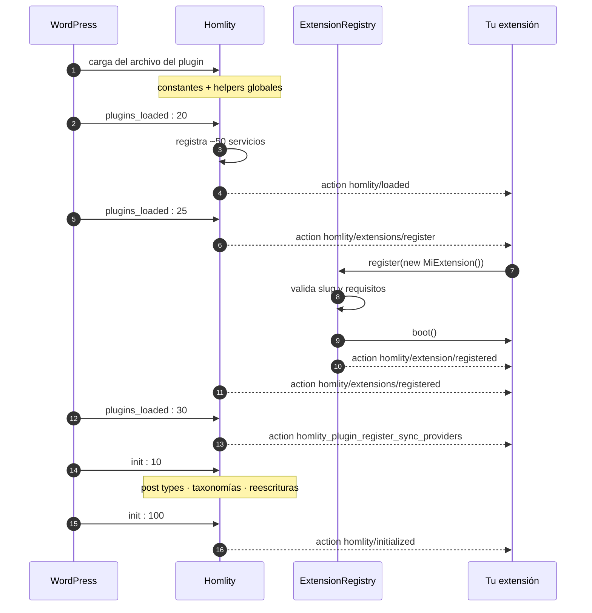

# Ciclo de vida de una extensión

Qué ocurre, en qué orden, y qué puedes hacer en cada momento.

---

## La línea temporal



---

## Fase 1 · Carga del archivo

**Cuándo.** Cuando WordPress incluye `plugin-inmobiliario.php`, antes de
cualquier hook.

**Qué existe.** Las constantes `HOMLITY_*`, los autoloaders y los helpers
globales.

**Qué existe *si* tu plugin cargó antes.** Nada de lo anterior. WordPress no
garantiza el orden.

**Qué hacer.** Nada, salvo definir tus propias constantes y cargar tus clases.

```php
if (defined('HOMLITY_PLUGIN_VERSION')) {
    // Sólo esto es fiable en esta fase.
}
```

---

## Fase 2 · `plugins_loaded` prioridad 20

**Qué ocurre.** `PluginBootstrap::init()` registra todos los servicios del
núcleo y dispara `homlity/loaded`.

**Qué existe ahora.** La Developer API entera. Post types y taxonomías **no**.

**Qué hacer.** Comprobar la versión, preparar cosas que no dependan de consultar
inmuebles.

```php
add_action('homlity/loaded', function () {
    if (!homlity_is_version_supported('2.9.0')) {
        // funcionalidad reducida
    }
});
```

---

## Fase 3 · `plugins_loaded` prioridad 25 — el registro

Tres momentos encadenados.

### 3.1 · Se abre la ventana

```php
do_action('homlity/extensions/register', $registry);
```

Aquí llamas a `register()`. El registro valida antes de aceptar:

1. ¿El slug es utilizable después de `sanitize_key()`?
2. ¿Está libre?
3. ¿Se cumplen los requisitos declarados?
4. ¿Lo confirma el filtro `homlity/extension/is_compatible`?

Si algo falla, `register()` devuelve `false`, se dispara
`homlity/extension/failed` con los motivos y tu `boot()` **no** se llama.

### 3.2 · Arranque

`ExtensionRegistry::bootAll()` llama a `boot()` en cada extensión aceptada, en
orden de registro.

Si `boot()` lanza, el registro captura la excepción, convierte la extensión en
un fallo y **sigue con la siguiente**. Una extensión rota no se lleva por
delante a las demás ni al sitio.

**Qué hacer en `boot()`.** Enganchar hooks. Nada más:

```php
public function boot(): void
{
    add_action('homlity/property/updated', [$this, 'push'], 10, 3);
    add_action('homlity/initialized', [$this, 'setup']);
    add_action('rest_api_init', [$this, 'routes']);
}
```

**Qué no hacer.** Consultar inmuebles (no hay post type todavía), llamar a APIs
externas (se ejecuta en cada petición), escribir en la base de datos.

### 3.3 · Se cierra la ventana

```php
do_action('homlity/extensions/registered', $registry);
```

Todas arrancaron. Aquí ya puedes preguntar por el censo:

```php
add_action('homlity/extensions/registered', function ($registry) {
    if ($registry->has('otro-crm')) {
        remove_action('homlity/property/updated', [$this, 'push'], 10);
    }
});
```

---

## Fase 4 · `plugins_loaded` prioridad 30

`homlity_plugin_register_sync_providers`, para los proveedores de
sincronización bajo demanda. Es posterior al registro de extensiones a
propósito: un proveedor puede vivir dentro de una extensión y engancharse desde
su `boot()`.

---

## Fase 5 · `init` prioridad 10

WordPress registra el post type `property`, las doce taxonomías, los shortcodes
y las reglas de reescritura.

**Ya puedes** consultar inmuebles. Pero espera a la fase 6 si puedes: en la 99
todavía pueden correr migraciones.

---

## Fase 6 · `init` prioridad 100

```php
do_action('homlity/initialized');
```

Todo está en su sitio. Es el momento seguro para cualquier trabajo que dependa
de los datos.

```php
add_action('homlity/initialized', function () {
    $property = homlity_properties()->findByCode('VTAP1320041');
});
```

---

## Fuera del arranque

### Activación y desactivación

`register_activation_hook` corre **antes** de que Homlity cargue en esa
petición. No puedes usar la Developer API ahí.

```php
register_activation_hook(__FILE__, function () {
    // Sólo lo que WordPress sabe por sí mismo.
    if (version_compare(PHP_VERSION, '8.0', '<')) {
        deactivate_plugins(plugin_basename(__FILE__));
        wp_die('Se necesita PHP 8.0 o superior.');
    }

    add_option('mi_crm_ajustes', []);
});
```

Si necesitas trabajo de activación que sí dependa de Homlity, deja una bandera y
resuélvela en `homlity/initialized`:

```php
register_activation_hook(__FILE__, fn() => update_option('mi_crm_pendiente', '1'));

add_action('homlity/initialized', function () {
    if (get_option('mi_crm_pendiente') !== '1') {
        return;
    }

    // …

    delete_option('mi_crm_pendiente');
});
```

### Desinstalación

`uninstall.php` corre en una petición donde puede que nada esté cargado. Usa
sólo funciones del núcleo de WordPress.

```php
<?php
if (!defined('WP_UNINSTALL_PLUGIN')) {
    exit;
}

delete_option('mi_crm_ajustes');
delete_option('mi_crm_log');
```

---

## Tabla de referencia

| Momento | Hook | Post types listos | Consultar inmuebles |
| --- | --- | :---: | :---: |
| Carga del archivo | — | ✗ | ✗ |
| `plugins_loaded` : 20 | `homlity/loaded` | ✗ | ✗ |
| `plugins_loaded` : 25 | `homlity/extensions/register` | ✗ | ✗ |
| — | `boot()` | ✗ | ✗ |
| — | `homlity/extensions/registered` | ✗ | ✗ |
| `plugins_loaded` : 30 | `homlity_plugin_register_sync_providers` | ✗ | ✗ |
| `init` : 10 | — | ✓ | ✓ |
| `init` : 100 | `homlity/initialized` | ✓ | ✓ |
| Después | `wp`, `template_redirect`, … | ✓ | ✓ |

---

## Registrar fuera de la ventana

El registro es deliberadamente tolerante:

- **Antes** de que se abra: la extensión queda en cola y arranca cuando llegue
  el momento.
- **Después** de que se cierre: arranca en el acto, porque no habrá otro
  despacho.

```php
if (homlity_extensions()->isDispatched()) {
    // Registrar ahora arrancará la extensión inmediatamente.
}
```

Aun así, regístrate en la ventana. Es lo predecible, y es lo que garantiza que
tus hooks estén puestos antes de que ocurra el primer evento.
