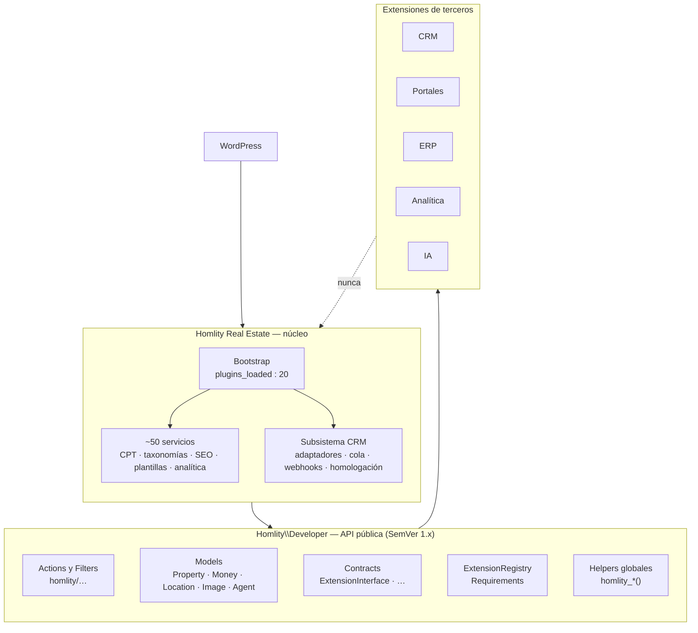
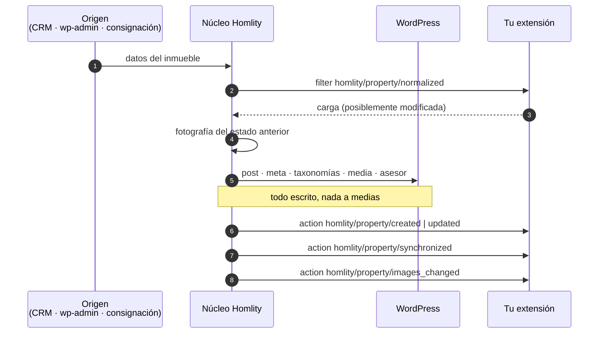

# Arquitectura

Qué hay entre WordPress y tu extensión, y por qué está donde está.

---

## El mapa

La flecha punteada es la regla entera: tu extensión no debe alcanzar el núcleo
directamente.

---

## Público frente a interno

| | Público | Interno |
| --- | --- | --- |
| Namespace | `Homlity\Developer\` | `Homlity\PluginInmobiliario\`, `Homlity_*` |
| Hooks | `homlity/dominio/evento` | `homlity_*`, `homlity_plugin_*`, `homlity_crm_*`, … |
| Funciones | `homlity_version()`, `homlity_get_property()`, … | todo lo demás |
| Datos | El modelo `Property` | meta `_property_*`, taxonomías, tablas |
| Estabilidad | SemVer, sin rupturas dentro de 1.x | puede cambiar en cualquier versión |
| Documentado | Sí, aquí | No |

### ¿Por qué no se movió el código interno a `Homlity\Internal\`?

Porque mover 200 clases habría roto todas las instalaciones existentes y todos
los plugins de terceros que hoy referencian `SyncRegistry` o
`CrmAdapterInterface`. La frontera se declara, no se muda: **`Homlity\Developer\`
es público, todo lo demás es interno**. Es una regla igual de clara y no cuesta
una migración.

---

## Orden de arranque

Lo único de la mecánica interna que necesitas conocer.

| Momento | Qué ocurre | Qué puedes hacer |
| --- | --- | --- |
| Carga del archivo | Constantes y helpers globales | `defined('HOMLITY_PLUGIN_VERSION')` |
| `plugins_loaded` : 20 | El núcleo registra sus servicios | — |
| `homlity/loaded` | El núcleo terminó | Comprobar versión, preparar cosas |
| `plugins_loaded` : 25 | `homlity/extensions/register` | **Registrar tu extensión** |
| — | `ExtensionRegistry::bootAll()` → `boot()` de cada una | **Enganchar tus hooks** |
| — | `homlity/extensions/registered` | Ver el censo de extensiones |
| `plugins_loaded` : 30 | `homlity_plugin_register_sync_providers` | Registrar un proveedor de sync |
| `init` : 10 | CPT, taxonomías, reescrituras | — |
| `init` : 100 | `homlity/initialized` | **Consultar inmuebles** |

La regla práctica: en `boot()` sólo se engancha; el trabajo va en `init` o
después.

---

## Flujo de un inmueble

Que las acciones vayan **después** de toda la escritura no es un detalle: es lo
que hace que `$property->getImages()` devuelva las fotos nuevas y no las
viejas, y lo que distingue estos hooks del `save_post` de WordPress.

---

## Piezas de la API

### Modelos — `Homlity\Developer\Models\`

Objetos inmutables de sólo lectura.
`Property` es el principal; `Money`, `Location`, `Image` y `Agent` son sus
partes. Ver [el modelo Property](../models/property.md).

### Eventos — `Homlity\Developer\Events\`

`PropertyContext` responde a «¿quién escribió esto?»; `PropertyChanges`, a
«¿qué cambió exactamente?». Los dos viajan en las acciones del ciclo de vida.

### Extensiones — `Homlity\Developer\Extension\`

`ExtensionRegistry` mantiene el censo; `Requirements` describe qué necesita cada
extensión para arrancar.

### Contratos — `Homlity\Developer\Contracts\`

`ExtensionInterface` y los dos contratos de sincronización que el núcleo ya
consumía desde antes, publicados ahora bajo el namespace estable.

### Servicios — `Homlity\Developer\Services\`

`PropertyRepository`: buscar inmuebles por ID, por código o por identificador
de CRM.

### Soporte — `Homlity\Developer\Support\`

`Hooks` (los nombres como constantes) y `Deprecated` (el mecanismo de retirada).

---

## Por qué hooks de WordPress y no un bus de eventos propio

Porque WordPress ya tiene uno, todo el mundo lo conoce, y trae gratis las
prioridades, la eliminación de callbacks, la inspección y la compatibilidad con
cualquier otro plugin.

Lo que sí aporta un objeto es la *forma de los datos*: por eso el diff y el
origen son objetos (`PropertyChanges`, `PropertyContext`) y el transporte sigue
siendo `do_action`.
