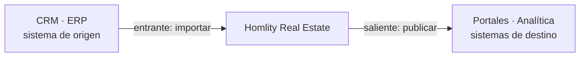
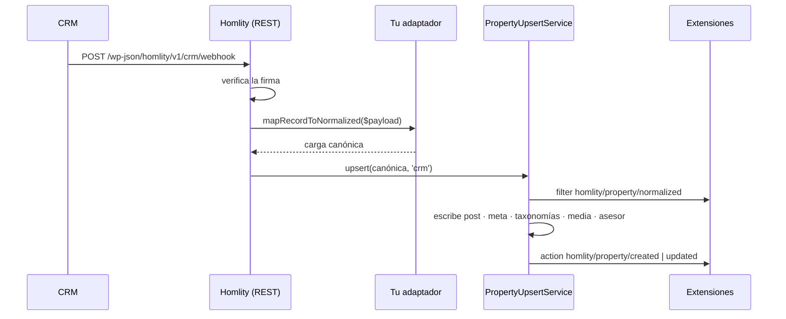
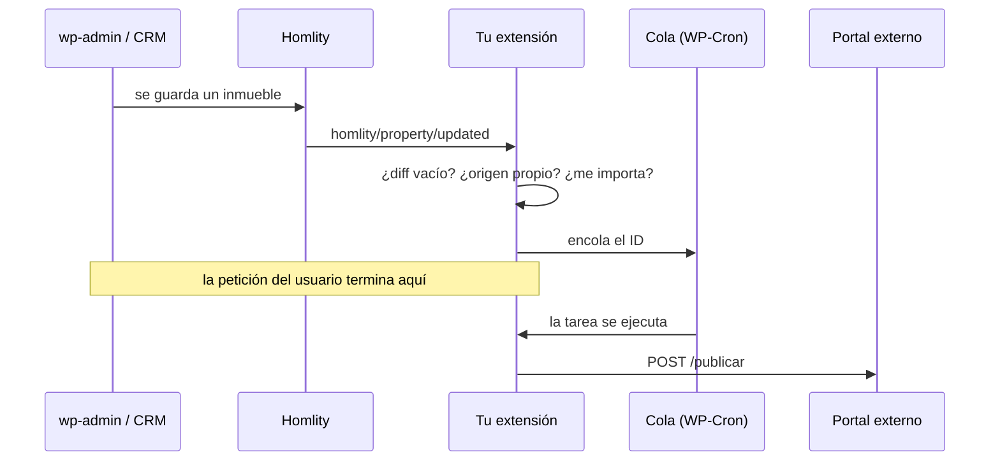
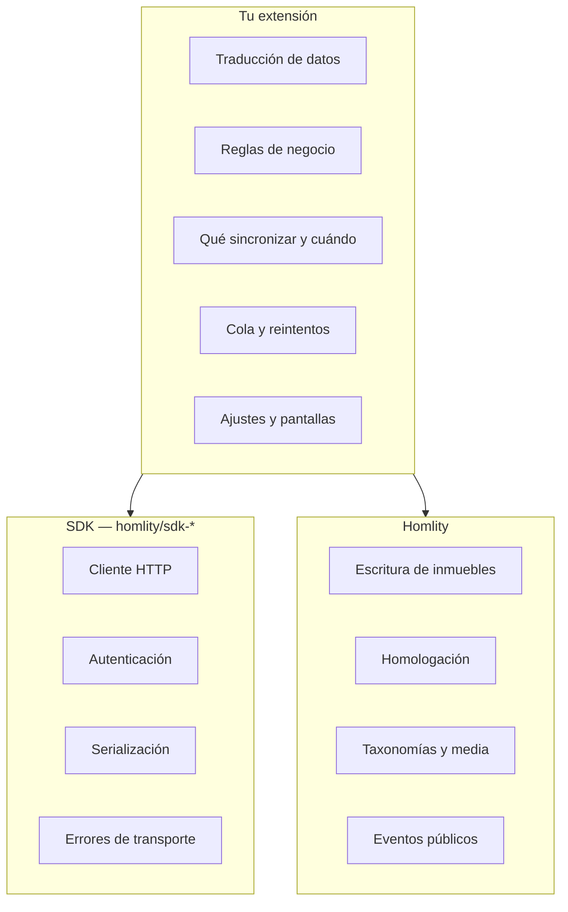

# Arquitectura de integración

Cómo se conecta Homlity con un sistema externo, y dónde encaja tu código.

---

## Las dos direcciones

Una integración inmobiliaria hace una de estas dos cosas, o las dos:



| Dirección | Qué hace | Piezas |
| --- | --- | --- |
| **Entrante** | Traer inmuebles a WordPress | `CrmAdapterInterface`, `PropertySyncProviderInterface`, `homlity/property/normalized` |
| **Saliente** | Llevar inmuebles fuera | `homlity/property/created`, `updated`, `deleted`, `images_changed` |

---

## Integración entrante

### Opción A · Adaptador de CRM

Para un CRM con webhooks o con una API que se pueda recorrer por lotes.



Tu trabajo se reduce a **traducir**. Escribir el post, resolver las taxonomías,
homologar las características y descargar las imágenes lo hace el núcleo.

```php
add_action('homlity_crm_register_adapters', function ($manager) {
    $manager->registerAdapter(new MiCrm\Adapter());
});
```

Ver [`CrmAdapterInterface`](../api/interfaces.md#crmadapterinterface).

### Opción B · Proveedor de sincronización bajo demanda

Para catálogos grandes donde no compensa importar todo por adelantado.

Cuando un visitante abre `/inmueble/{CODIGO}` y ese inmueble no existe en local,
Homlity pregunta a los proveedores registrados. El primero que lo crea gana, y
el visitante recibe un 301 a la URL canónica.

```php
add_action('homlity_plugin_register_sync_providers', function () {
    \Homlity\PluginInmobiliario\Services\SyncRegistry::addProvider(
        new MiCrm\SyncProvider()
    );
});
```

Ver
[`PropertySyncProviderInterface`](../api/interfaces.md#propertysyncproviderinterface).

### Opción C · Tu propio flujo

Nada te obliga a usar el subsistema de CRM. Puedes tener tu cron, tu cola y tus
endpoints, y llamar a la escritura canónica desde donde quieras.

**Escribe siempre a través de la carga canónica**, no con `wp_insert_post()`
directo. Es lo que dispara los hooks públicos, mantiene la deduplicación, la
homologación y el índice de sincronización, y evita que tu integración duplique
inmuebles.

### La homologación

Vale la pena entenderla porque resuelve el problema más pesado de integrar
varios CRMs.

Un CRM llama «Apto» a lo que otro llama «Apartamento» y un tercero
«APARTAMENTO». Homlity mantiene una tabla de mapeo que traduce cada valor de
cada CRM a un término canónico único.

Tu adaptador manda **nombres**, no slugs, en `taxonomy`. Homlity los resuelve.
Si un valor es nuevo, crea el término y lo registra en el mapeo, y el
administrador puede corregirlo después desde la pantalla de homologación sin
tocar tu código.

Aplica a: operaciones, tipos, categorías, características, países,
departamentos, ciudades y barrios.

---

## Integración saliente



Tres decisiones definen una integración saliente buena:

### 1 · Qué escuchar

| Hook | Para qué |
| --- | --- |
| `homlity/property/created` | Publicar por primera vez |
| `homlity/property/updated` | Actualizar lo que cambió |
| `homlity/property/images_changed` | Volver a subir fotos |
| `homlity/property/status_changed` | Despublicar al pasar a borrador o papelera |
| `homlity/property/deleted` | Retirar definitivamente |

### 2 · Qué descartar

```php
if ($changes->isEmpty())                   return;  // reenvío sin cambios
if ($context->getSource() === $this->slug) return;  // lo causé yo: sería un bucle
if (!$changes->hasGroup('pricing'))        return;  // no es comercial
```

### 3 · Cuándo llamar al exterior

Nunca dentro del hook. Encola el ID y trabaja en segundo plano. Ver
[Buenas prácticas](../extensions/best-practices.md#6--el-trabajo-lento-va-en-segundo-plano).

---

## Integración bidireccional

Lo más frecuente en la práctica, y donde está el error clásico: el bucle
infinito.

```
CRM → Homlity → CRM → Homlity → …
```

Homlity te da la herramienta para cortarlo en el primer salto:

```php
public function onUpdated(Property $p, PropertyChanges $c, PropertyContext $ctx): void
{
    // Si esta escritura vino de mi propio CRM, no se la devuelvo.
    if ($ctx->getSource() === 'mi-crm') {
        return;
    }

    $this->push($p);
}
```

`$context->getSource()` lleva la clave del CRM que originó la escritura, y
`$context->getOrigin()` distingue wp-admin de una sincronización. Con esas dos
piezas el bucle se corta sin necesidad de banderas ni de marcas de tiempo.

---

## Dónde poner cada cosa



Un error frecuente es meter la lógica de sincronización dentro del SDK. Los SDK
oficiales de Homlity encapsulan **sólo la comunicación**: qué endpoint, qué
cabeceras, cómo se autentica, cómo se serializa. Decidir qué se sincroniza y
cuándo es de la extensión.

Ver [SDKs oficiales](sdk-usage.md).

---

## Lista de comprobación

Antes de dar por buena una integración:

- [ ] Escribes a través de la carga canónica, no con `wp_insert_post()`.
- [ ] Mandas nombres en `taxonomy`, no slugs.
- [ ] `external.source` y `external.id` son estables entre sincronizaciones —de
      ellos depende la deduplicación.
- [ ] Cortas el bucle con `$context->getSource()`.
- [ ] Descartas el diff vacío.
- [ ] El trabajo lento va en segundo plano.
- [ ] Hay reintentos con espera creciente ante un fallo del sistema externo.
- [ ] Las credenciales no están en la base de datos en claro.
- [ ] Un inmueble borrado se retira también del sistema externo.
- [ ] Desactivar la extensión limpia sus eventos de cron.
