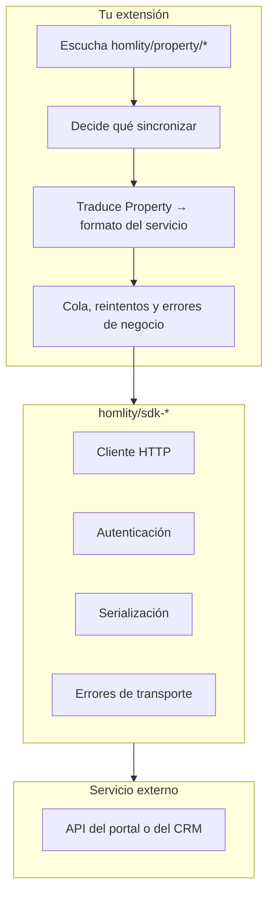

# SDKs oficiales de Homlity

Homlity publica una familia de SDK en PHP que encapsulan la comunicación con
CRMs y portales inmobiliarios del mercado hispanohablante.

> **Los SDK encapsulan la comunicación con servicios externos. La lógica de
> sincronización y de negocio pertenece a cada implementación o extensión.**

Esa frase es la regla de diseño de toda la familia. Un SDK sabe *cómo hablar*
con un servicio: qué endpoint, qué cabeceras, cómo se autentica, cómo se
serializa una respuesta, qué significa cada código de error. No sabe —ni debe
saber— qué inmuebles hay que sincronizar, cada cuánto, ni qué hacer cuando uno
cambia de precio. Eso es de tu extensión.

---

## Catálogo

| Paquete | Servicio | Packagist |
| --- | --- | --- |
| `homlity/chat-sdk` | Chat de Homlity | <https://packagist.org/packages/homlity/chat-sdk> |
| `homlity/sdk-ciencuadras` | Ciencuadras | <https://packagist.org/packages/homlity/sdk-ciencuadras> |
| `homlity/sdk-domus` | Domus | <https://packagist.org/packages/homlity/sdk-domus> |
| `homlity/sdk-fincaraiz` | Fincaraíz | <https://packagist.org/packages/homlity/sdk-fincaraiz> |
| `homlity/sdk-mobilia` | Mobilia | <https://packagist.org/packages/homlity/sdk-mobilia> |
| `homlity/sdk-proppit` | Proppit | <https://packagist.org/packages/homlity/sdk-proppit> |
| `homlity/sdk-smarthome` | SmartHome | <https://packagist.org/packages/homlity/sdk-smarthome> |
| `homlity/sdk-softinm` | Softinm | <https://packagist.org/packages/homlity/sdk-softinm> |
| `homlity/sdk-wasi-php8` | Wasi (PHP 8) | <https://packagist.org/packages/homlity/sdk-wasi-php8> |

Todos en <https://packagist.org/packages/homlity/> y
<https://github.com/homlity>.

Consulta el README de cada paquete para su API concreta, sus requisitos de
versión y sus credenciales: cada servicio externo tiene la suya y esta página
no las duplica —duplicarlas sería garantizar que se quedan desactualizadas.

---

## Instalación

```bash
composer require homlity/sdk-wasi-php8
```

En una extensión de WordPress, instala sólo lo de producción y genera el
autoloader optimizado antes de empaquetar:

```bash
composer install --no-dev --optimize-autoloader
```

Y carga el autoloader de forma defensiva: otro plugin puede haber cargado ya una
versión distinta de la misma librería.

```php
if (is_file(__DIR__ . '/vendor/autoload.php')) {
    require_once __DIR__ . '/vendor/autoload.php';
}
```

---

## Dónde encaja cada pieza



| Responsabilidad | ¿Del SDK? | ¿De la extensión? |
| --- | :---: | :---: |
| Construir la petición HTTP | ✓ | |
| Autenticarse | ✓ | |
| Interpretar la respuesta | ✓ | |
| Distinguir un 401 de un 503 | ✓ | |
| Decidir qué inmuebles se publican | | ✓ |
| Traducir un `Property` al formato del servicio | | ✓ |
| Reintentar, encolar, esperar | | ✓ |
| Guardar credenciales | | ✓ |
| Pantalla de ajustes | | ✓ |
| Notificar al administrador | | ✓ |

---

## Patrón: publicar en un portal

El esqueleto de una integración saliente que usa un SDK. Los nombres de clase y
de método del SDK son ilustrativos; los reales están en su README.

```php
<?php

namespace Acme\PortalSync;

use Homlity\Developer\Contracts\ExtensionInterface;
use Homlity\Developer\Events\PropertyChanges;
use Homlity\Developer\Events\PropertyContext;
use Homlity\Developer\Extension\Requirements;
use Homlity\Developer\Models\Property;
use Throwable;

final class Extension implements ExtensionInterface
{
    public function getName(): string    { return 'Acme · Publicar en el portal'; }
    public function getSlug(): string    { return 'acme-portal-sync'; }
    public function getVersion(): string { return '1.0.0'; }

    public function getRequirements(): Requirements
    {
        return Requirements::create(['api' => '1.0.0', 'php' => '8.0']);
    }

    public function boot(): void
    {
        add_action('homlity/property/created', [$this, 'onCreated'], 10, 2);
        add_action('homlity/property/updated', [$this, 'onUpdated'], 10, 3);
        add_action('homlity/property/deleted', [$this, 'onDeleted'], 10, 2);

        // El trabajo real ocurre aquí, fuera de la petición del usuario.
        add_action('acme_portal_push', [$this, 'push']);
        add_action('acme_portal_remove', [$this, 'remove']);
    }

    public function onCreated(Property $property, PropertyContext $context): void
    {
        $this->enqueue('acme_portal_push', $property->getId());
    }

    public function onUpdated(Property $property, PropertyChanges $changes, PropertyContext $context): void
    {
        if ($changes->isEmpty()) {
            return;
        }

        if (!$changes->hasGroup('pricing')
            && !$changes->has('media.gallery')
            && !$changes->has('post.title')
        ) {
            return;
        }

        $this->enqueue('acme_portal_push', $property->getId());
    }

    public function onDeleted(Property $property, int $postId): void
    {
        // El inmueble no existirá cuando corra la tarea: pasa la referencia.
        $this->enqueue('acme_portal_remove', $property->getCode());
    }

    /** @param int|string $argument */
    private function enqueue(string $hook, $argument): void
    {
        if (wp_next_scheduled($hook, [$argument])) {
            return;   // ya encolado: no dupliques
        }

        wp_schedule_single_event(time() + 30, $hook, [$argument]);
    }

    public function push(int $propertyId): void
    {
        $property = homlity_get_property($propertyId);
        if ($property === null) {
            return;   // lo borraron entre el encolado y ahora
        }

        try {
            $this->client()->publish($this->toPortalPayload($property));
        } catch (Throwable $e) {
            $this->handleFailure($propertyId, $e);
        }
    }

    public function remove(string $code): void
    {
        try {
            $this->client()->withdraw($code);
        } catch (Throwable $e) {
            if (defined('WP_DEBUG') && WP_DEBUG) {
                error_log('[acme-portal] ' . $e->getMessage());
            }
        }
    }

    /**
     * La traducción. Esto es lo que **no** hace el SDK.
     *
     * @return array<string,mixed>
     */
    private function toPortalPayload(Property $property): array
    {
        $price     = $property->getPrice();
        $location  = $property->getLocation();

        return [
            'reference'    => $property->getCode(),
            'title'        => $property->getTitle(),
            'description'  => wp_strip_all_tags($property->getDescription()),
            'operation'    => $property->getOperation(),
            'type'         => $property->getPropertyType(),
            'price'        => $price?->getAmount(),
            'currency'     => $price?->getCurrency(),
            'rooms'        => $property->getBedrooms(),
            'baths'        => $property->getBathrooms(),
            'area'         => $property->getArea(),
            'city'         => $location->getCity(),
            'neighborhood' => $location->getNeighborhood(),
            'latitude'     => $location->getLatitude(),
            'longitude'    => $location->getLongitude(),
            // Vacío si el propietario pidió ocultar la dirección exacta.
            'address'      => $location->getAddress(),
            'images'       => array_map(
                static fn($image) => $image->getUrl(),
                $property->getImages()
            ),
            'url'          => $property->getUrl(),
        ];
    }

    private function client(): object
    {
        // Las credenciales, fuera de la base de datos siempre que se pueda.
        $token = defined('ACME_PORTAL_TOKEN')
            ? ACME_PORTAL_TOKEN
            : (string) get_option('acme_portal_token', '');

        return new \Homlity\Sdk\Portal\Client($token);
    }

    private function handleFailure(int $propertyId, Throwable $error): void
    {
        $attempts = (int) get_post_meta($propertyId, '_acme_portal_attempts', true);

        if ($attempts >= 5) {
            update_post_meta($propertyId, '_acme_portal_error', $error->getMessage());
            return;   // se rinde y deja constancia, en vez de reintentar sin fin
        }

        update_post_meta($propertyId, '_acme_portal_attempts', $attempts + 1);

        // Espera creciente: 1, 2, 4, 8, 16 minutos.
        wp_schedule_single_event(
            time() + (60 * (2 ** $attempts)),
            'acme_portal_push',
            [$propertyId]
        );
    }
}
```

---

## Patrón: importar desde un CRM

Con un SDK entrante, el reparto es el mismo al revés: el SDK trae los registros
crudos y tu adaptador los traduce a la carga canónica.

```php
public function mapRecordToNormalized(array $payload, array $context = []): array
{
    return [
        'external' => [
            'source' => 'wasi',
            'id'     => (string) ($payload['id_property'] ?? ''),
            'raw'    => $payload,
        ],
        'post' => [
            'title' => (string) ($payload['title'] ?? ''),
        ],
        // …
    ];
}
```

El esquema completo está en
[el modelo Property](../models/property.md#esquema-canónico).

---

## Credenciales

Nunca en el repositorio. Nunca en un hook. Preferiblemente ni siquiera en la
base de datos.

```php
// Mejor: fuera de la base de datos y de los backups.
define('ACME_PORTAL_TOKEN', '…');   // en wp-config.php

// Aceptable: sin autoload y sin exponerla en REST.
update_option('acme_portal_token', $token, false);
```

Si tu extensión ofrece una pantalla de ajustes para introducir la credencial,
enmascárala al mostrarla y no la devuelvas nunca por una ruta REST.

---

## Versiones

Los SDK siguen SemVer, igual que la Developer API. Fija la versión mayor:

```json
{
  "require": {
    "homlity/sdk-wasi-php8": "^1.0"
  }
}
```

Si tu extensión se distribuye como ZIP, incluye `vendor/` con
`composer install --no-dev --optimize-autoloader` y **no** versiones `vendor/`
en tu repositorio.

---

## Enlaces

- Packagist: <https://packagist.org/packages/homlity/>
- GitHub: <https://github.com/homlity>
- Developer API: <https://homlity.com/desarrolladores/>
