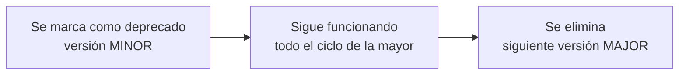

# Deprecaciones

Cómo se retira algo de la Developer API, y cuánto tiempo tienes para migrar.

---

## La promesa

**Nada público se elimina sin aviso.** Antes de desaparecer, todo pasa por un
ciclo de deprecación:



Durante la fase intermedia:

1. **Sigue funcionando exactamente igual.** Un aviso no es una ruptura.
2. **Avisa** en el log de errores cuando `WP_DEBUG` está activo.
3. **Indica el reemplazo**, cuando lo hay.
4. **Está documentado** aquí y en el [changelog](changelog-policy.md).

Eso te da como mínimo un ciclo mayor completo para migrar.

---

## Cómo te enteras

Desarrolla con `WP_DEBUG` activo:

```php
define('WP_DEBUG', true);
define('WP_DEBUG_LOG', true);
define('WP_DEBUG_DISPLAY', false);
```

En `wp-content/debug.log` verás:

```
Notice: El hook «homlity/property/old_hook» está obsoleto desde la versión 2.9.0.
Este punto de extensión de Homlity se eliminará en la próxima versión mayor.
Usa «homlity/property/new_hook».
```

Sin `WP_DEBUG` el aviso se calla, y entonces te enteras cuando la funcionalidad
desaparece. Esa es la diferencia entre arreglarlo mientras escribes el código y
arreglarlo mientras un cliente espera.

---

## Deprecaciones vigentes

Ninguna.

La Developer API 1.0.0 es la versión inicial: no hay nada que retirar todavía.
Esta sección se irá llenando y es el sitio donde mirar antes de actualizar.

| Elemento | Deprecado en | Se elimina en | Reemplazo |
| --- | --- | --- | --- |
| — | — | — | — |

---

## Los hooks con guion bajo **no** están deprecados

Conviene decirlo claro porque genera confusión.

Homlity tiene ~90 hooks anteriores a la Developer API —
`homlity_crm_adapters`, `homlity_consignment_payload`, `homlity_schema_graph`,
`homlity_faq_*`… Siguen funcionando, no emiten avisos y no hay plan de
retirarlos.

Lo que sí ocurre es que **no forman parte del contrato**: no están cubiertos por
SemVer y pueden cambiar en una versión menor. Si dependes de uno, fija la
versión de Homlity en tus requisitos y vigila el changelog.

Ver la [convención de nombres](../api/overview.md#convención-de-nombres).

---

## El mecanismo

`Homlity\Developer\Support\Deprecated` envuelve las funciones de WordPress y
añade el contexto de Homlity. Puedes usarlo también para las deprecaciones de tu
propia extensión.

### Un hook

Dispara siempre el reemplazo **primero**, para que quien escuche el nuevo vea el
mismo estado que quien escucha el viejo:

```php
use Homlity\Developer\Support\Deprecated;

do_action('mi-crm/inmueble/enviado', $property);

Deprecated::action(
    'mi_crm_property_sent',        // el deprecado
    [$property],                   // sus argumentos
    '2.0.0',                       // versión que lo depreca
    'mi-crm/inmueble/enviado'      // el reemplazo
);
```

### Un filtro

```php
$payload = apply_filters('mi-crm/payload', $payload, $property);

$payload = Deprecated::filter(
    'mi_crm_payload',
    [$payload, $property],
    '2.0.0',
    'mi-crm/payload'
);
```

Nota el orden: el valor pasa por el filtro nuevo y **después** por el viejo, de
modo que quien no haya migrado siga teniendo la última palabra.

### Una función

```php
function mi_crm_get_property(int $id)
{
    Deprecated::fn(__FUNCTION__, '2.0.0', 'homlity_get_property()');

    return homlity_get_property($id);
}
```

### Un argumento

```php
function mi_crm_push(int $id, bool $legacy = false)
{
    if ($legacy) {
        Deprecated::argument(
            __FUNCTION__,
            '2.0.0',
            'El argumento $legacy ya no tiene efecto.'
        );
    }
}
```

---

## Cómo migrar

1. **Activa `WP_DEBUG`** en tu entorno de desarrollo.
2. **Ejercita tu extensión**: crea un inmueble, edítalo, bórralo, sincroniza.
3. **Lee `debug.log`** y busca `homlity`.
4. **Sustituye** cada elemento deprecado por su reemplazo.
5. **Sube el mínimo** en `getRequirements()` si el reemplazo es más nuevo:

   ```php
   Requirements::create(['api' => '1.1.0'])
   ```

6. **Publica una versión MINOR** de tu extensión y anúncialo en tu changelog.

Si necesitas soportar las dos versiones a la vez:

```php
public function boot(): void
{
    if (homlity_is_version_supported('2.9.0')) {
        add_action('homlity/property/new_hook', [$this, 'handle'], 10, 2);
    } else {
        add_action('homlity/property/old_hook', [$this, 'handle'], 10, 2);
    }
}
```

---

## Cuándo se depreca algo

Homlity depreca un elemento público cuando:

- su diseño resultó equivocado y hay uno mejor;
- duplica otro punto de extensión;
- expone algo que no debería ser público;
- deja de tener sentido porque la funcionalidad que soportaba desapareció.

Y **no** lo depreca por gusto: cada deprecación cuesta trabajo a todos los que
construyeron encima. Ese coste es la razón por la que la superficie pública es
deliberadamente pequeña.

---

## Si algo desaparece sin deprecación

Es un error. Ábrelo como incidencia con la etiqueta `breaking-change` y se
tratará como una regresión.

Ver [Reportar incidencias](../open-source/reporting-issues.md).
